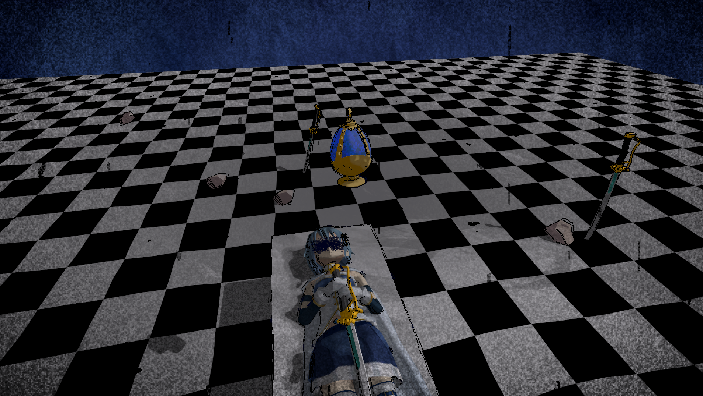
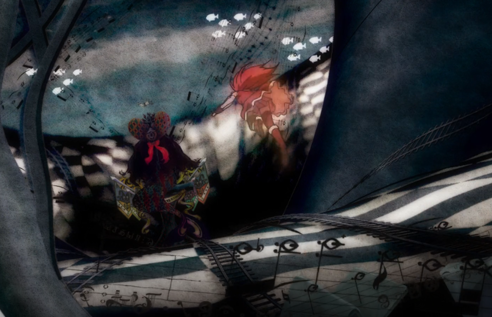
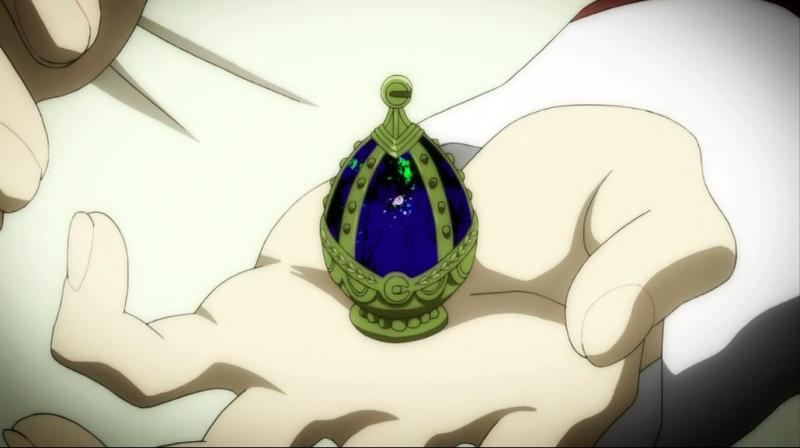
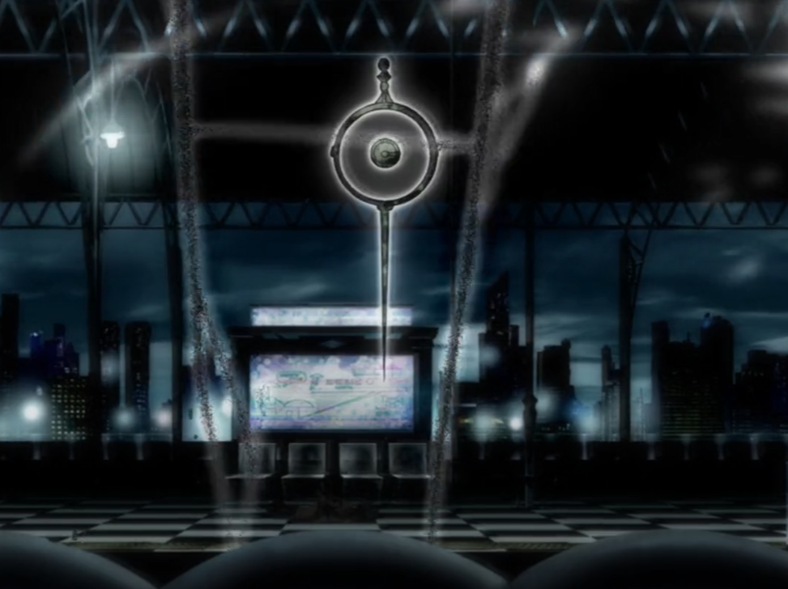
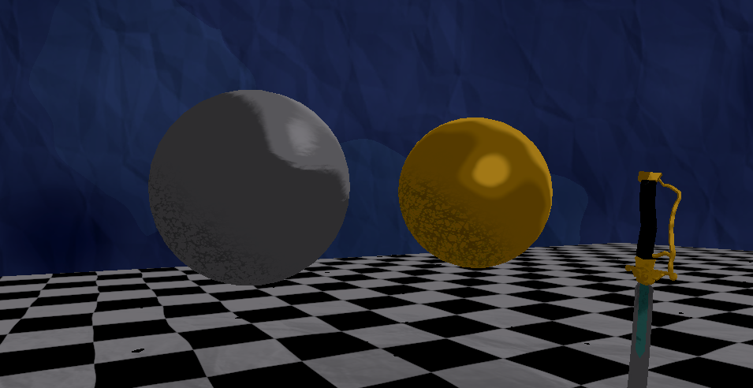
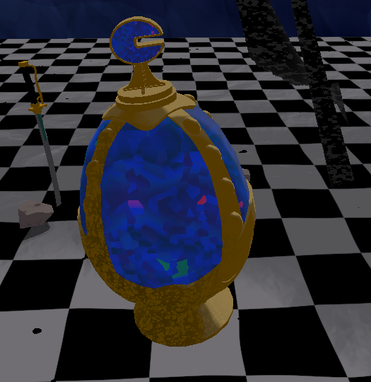
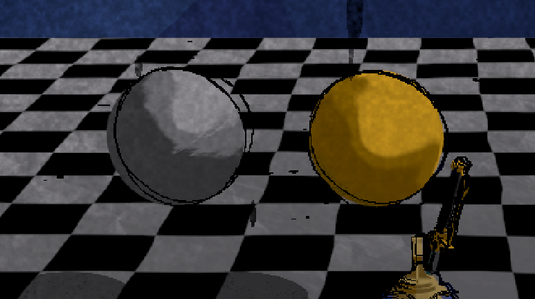
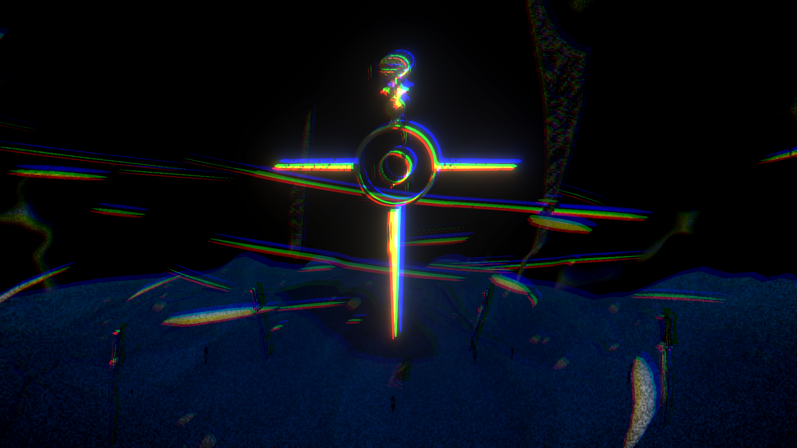
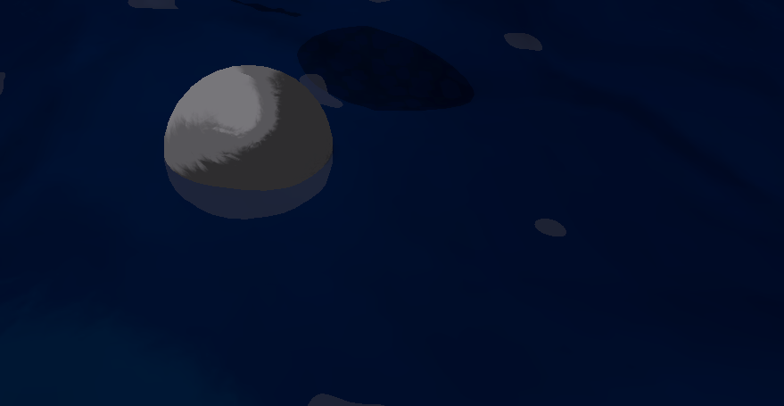

# HW 4: *3D Stylization*

## Demo

https://github.com/user-attachments/assets/7f4004a1-b1e2-460f-a972-cdefd372809d

Song: Decretum (Puella Magi Madoka Magica OST)

## 1. Inspiration

I was inspired to make a piece based off of a memorable scene from the TV show Puella Magi Madoka Magica, an anime known for its unique stylistic choices that include cut-out paper and stop-motion textures.

|  |  |  |
|:--:|:--:|:--:|
| *Image 1* | *Image 2* | *Image 3* |

---
## 2. Interesting Shaders

### Toon Shader

On top of supporting multiple light sources, the toon material also incorporates rim lighting and Blinn-Phong specular highlights to convey the roughness of a material. To add a hand-drawn feel, I added shadows with a tiled scribble texture, and manipulated normals with a paper texture and noise before blending the discrete colors to create a more painterly appearance.

### Special Surface Shader

To create the blue surface of the gem, I distorted voronoi noise UVs and remapped each cell to a color gradient to create blue with red and green splotches, and then multiplied the result with screen space FBM noise to give it a clouded appearance, a parameter that can be changed to influence how dark and “polluted” the gem appears. This is mixed with the toon shader so that specular highlights can convey the gem’s glass texture.

The noise for this shader, as well as many other materials in the scene, are offset by time, which is changed with the floor function to add a stop motion aesthetic.

---
## 3. Outlines

I implemented multiple outlines in post-process using the Sobel operator on the normals of the scene, and then distorted the UVs with noise offset in increments by time, creating thin chaotic scribbles to fit my piece.

---
## 4. Full Screen Post Process Effects

To emulate this particular scene in the show and adhere to the character’s theme, I implemented a vignette, lens liquid, flashing brightness, and chromatic aberration. The vignette is multiplied with noise to darken the edges of the scene. The liquid on the lens is implemented through stretched scrolling noise passed through a step function.

To get random flashing, I sample noise with time as the UV input, blending the output with the final image. Lastly, sampling the separate color channels with different UV offsets creates the chromatic aberration effect. Shader keywords allow for conditional compilation, allowing for the flashing and the chromatic aberration effects to be toggled without adversely affecting performance when toggled off.

Finally, I utilize Unity’s built-in URP bloom post process effect to enhance the highlights of the scene.

---
## 5. Scene Creation

Credits:
“Sayaka Miki - 3D Model” (https://skfb.ly/pxH8E) by idgeyoga is licensed under Creative Commons Attribution (http://creativecommons.org/licenses/by/4.0/).

Other 3D assets were modelled by me.

The background skybox shader maps distorted voronoi noise to a gradient, which is then blended with the paper texture. More voronoi multiplied with brighter colors create the appearance of gaps in the dark clouds.

## 6. Interactivity

Pressing Space starts a transition that changes shader variables, darkening the sky material and the gem shader to give the soul gem its polluted look. Water also rises upwards to envelope the surroundings, fitting the character’s motif. Pressing Space again after the transition is done reverts the scene to normal.

The animation starts if the gem is left polluted.
 
---
## 7. Extra Credit

The animation presents an different terrain with several interesting features: the water shader, a wind shader, and a scene distortion shader.

The water shader deforms the vertices based on the stop-motion time. The water also uses scene depth, changing its color to off white when the depth between the rest of the scene is smaller than a threshold. This creates the water foam outlines when the water is intersecting with other objects.

The wind shader is created by darkening scrolling stretched voronoi noise with stretched simple noise, and using the result as the alpha for the texture with a high alpha clip threshold. The texture is applied to a cone so that the wind appears to rise upwards.

The transparent scene distortion shader offsets the UVs of the scene color with an animated twirling noise, creating long streaks of distortion.

I also use a particle system to create the black lightning, and the shader is stretched electricity textures overlayed with grainy noise.
