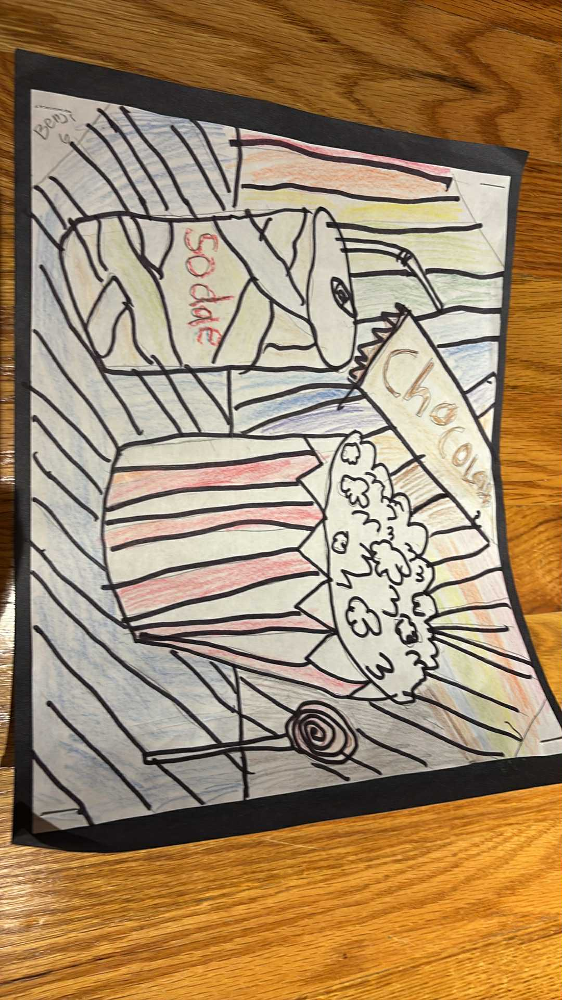
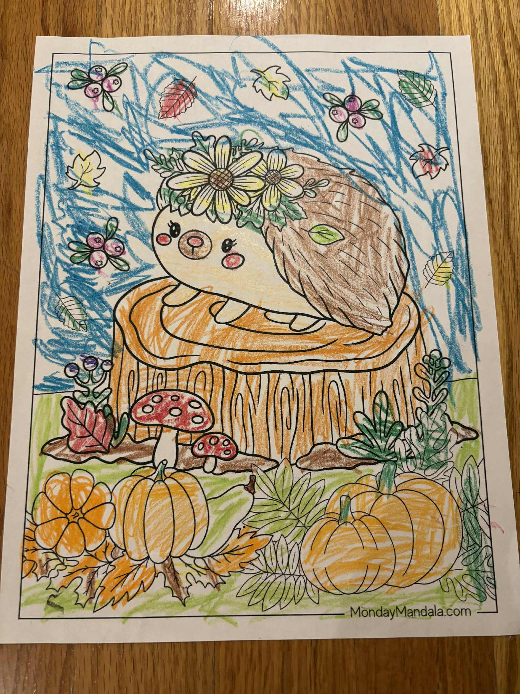
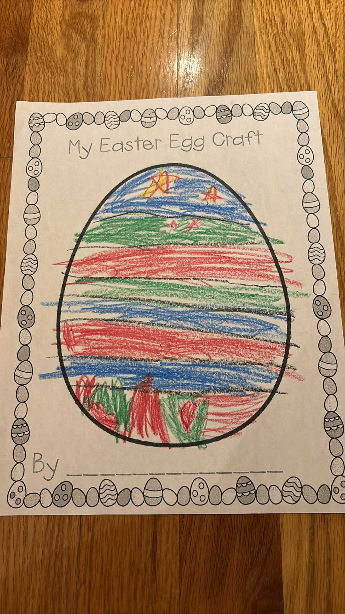
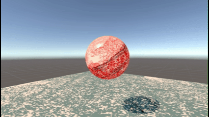
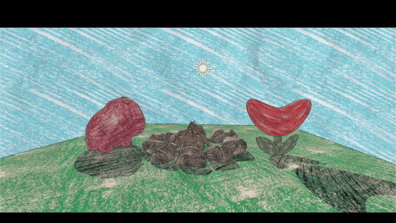
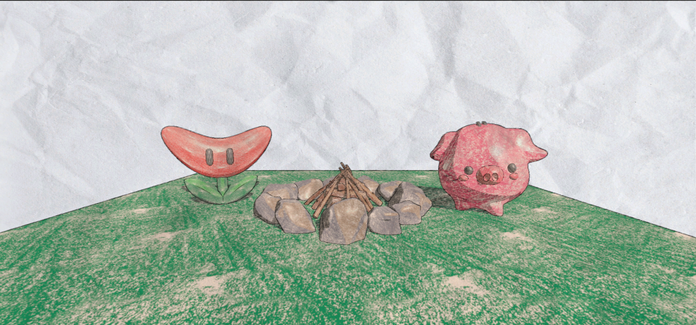
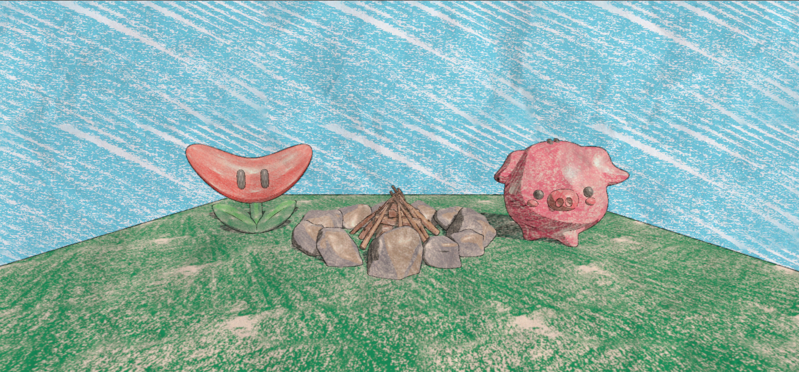
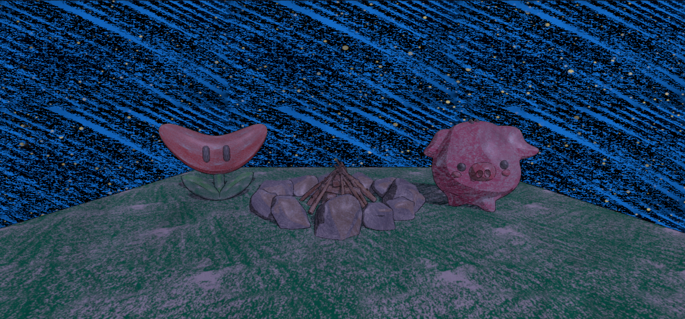

# HW 4: *3D Stylization*

  

## 1. Concept Art
For this project, I wanted to make a crayon shader. So my original idea and concept art stemmed from imagining a kid's coloring book, but that was also really hard to find references for, as I unfortunately do not have any kid friends. I did find this artist who created a crayon shader on blender, so that is also a good piece of concept art. And I asked one friend who has kids to send me pictures of her kids' work, so the beautiful colorings below are done by Benji Tritton.

[Oday Abuzaeed](https://www.artstation.com/artwork/vJd9KO)

  <h3>Benji's Artwork</h3>
  <table>
    <tr>
      <td></td>
      <td></td>
      <td></td>
    </tr>
  </table>

## 2. Interesting Shaders
I layered a black crayon texture into the shadows to give the scene a more scribbly, hand-drawn feel. I also added highlights, which originally shifted color from bright hues to an off-white, but I later changed it so that the shadow texture animates.

|  |  |
|---------|------------|
|  |  |

## 3. Outlines
I implemented custom outlines and stylized them with a crayon texture to resemble crayon strokes. These outlines are animated and will stretch, almost like they are being drawn or erased. This uses Robert's Cross filters.

## 4. Full Screen Post Process Effect
To give the entire scene that paper feel and maybe even the feeling that a child crumpled up this paper, I just added a paper texture to the scene.

## 5. Create a Scene
I modeled this campfire and added models I grabbed off of TurboSquid to add a child-like, friendly feel to it and chose models that children might actually draw.

## 6. Interactivity
On space key press, I made it so you can toggle light mode and dark mode. This changes the directional light color and intensity, updates the sky colors, and triggers a stylized night effect. I added animated stars (moving in the direction of the crayon strokes) and flickering to make the night mode feel more alive.

| Day Mode | Night Mode |
|---------|------------|
|  |  |

  

## Extra
I talked to Rui and got the okay with submitting this a day late!

