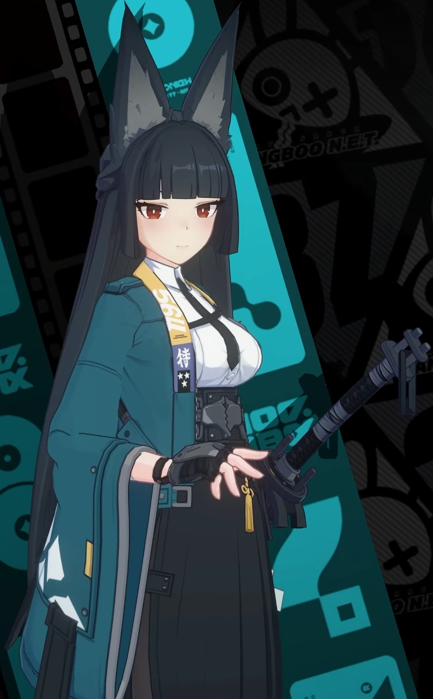
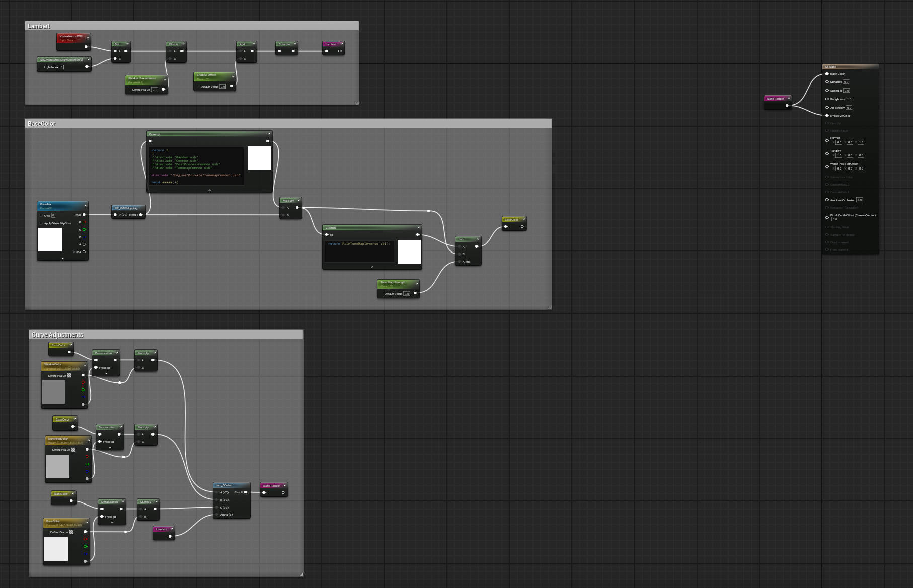
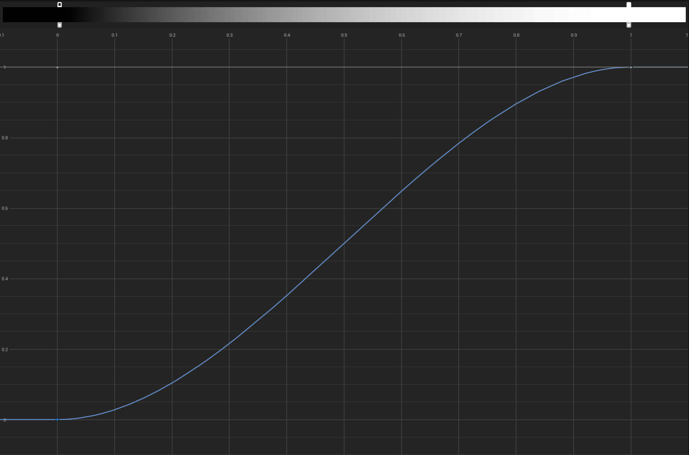
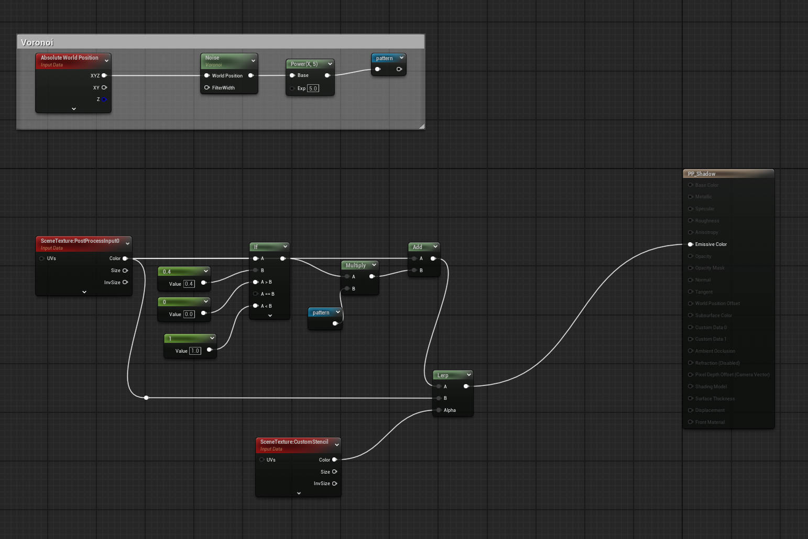
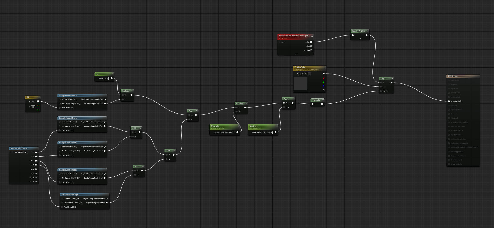
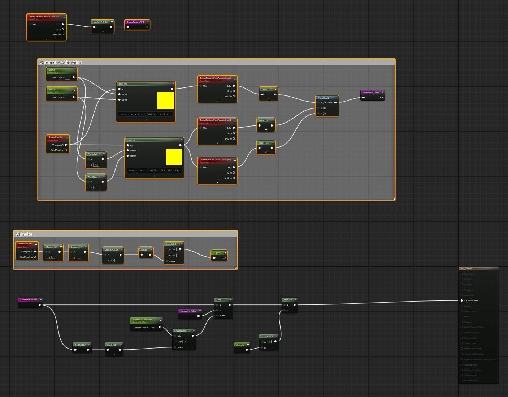

# Zenless Zone Zero Unreal Engine Render
# My Reference Concept Art:

# My Results:

https://github.com/user-attachments/assets/c6630811-2764-4390-82df-8cba4882744f

# Credits:

The model was taken from the offical, publically released MMD models. However, this means that the model comes with neither normal maps nor light maps, which made the model look slightly flat and has less control over the look of individual parts.

# Toon Shading
The basic idea is still constructing lambert shader and pluging it into emission. However, this time I used the default lit shading model instead of the unlit model, which allowed some support of features such as: multiple lights, shadows cast by other objects.

Then I used Curve Atlas to adjust the contrast of the images textures, which helped me achieve a overall more punchy look.

If the model had light maps and normal maps, I would have implemented some metallic specular by constructing blin-phong and masking it using light map onto only parts with metallic value over a certain threshold. Also I could use normal map to map vertex positions for the basic lambert shading model.

# Post Process
I think what really carried this project is the post process shaders. I used a custom stencil pass to mask out the character from the background, which allowed me to have a lot more contorl over the look of the shadows.
## Shadow
For the shadow post process, I basically did a very dense dotted effect with a Voroinoi noise of only 1 octave, then applied power adjust its shape. Then I simply multiplied it onto the shadow part of the image.

https://github.com/user-attachments/assets/a9d43767-2e53-4ef1-8a0e-27e6515623d6

## Outline
The outline is done by using the SampleSceneDepth node, which allowed me to find drastic changes in the depth pass and use that as a mask to drive the outlines.

https://github.com/user-attachments/assets/b4988d5b-d36b-4984-8c6d-f924e886deac

## Vignette & Chromatic Abberation
For Vignette, I simply converted the 0-1 viewport UV space into -1 to 1, and then used length as a radial mask.
For Chromatic Abberation, I just shifted the sampling viewport UV by a tiny amount to offset the red channel in one direction, and then the blue and green channels in the opposite direction.

https://github.com/user-attachments/assets/1ce22517-986e-466b-a478-1be7f1d4981b

## Interactivity
Although I did not create a keyboard interaction. I used the sequencer and animated the on and off of some post-process shaders for my turn table render.
Apologies the video compression is making it look really bad :(

https://github.com/user-attachments/assets/1139cd90-dbea-4a0b-ac50-a022ffd07f22

