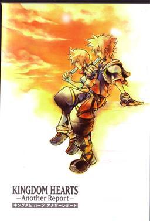
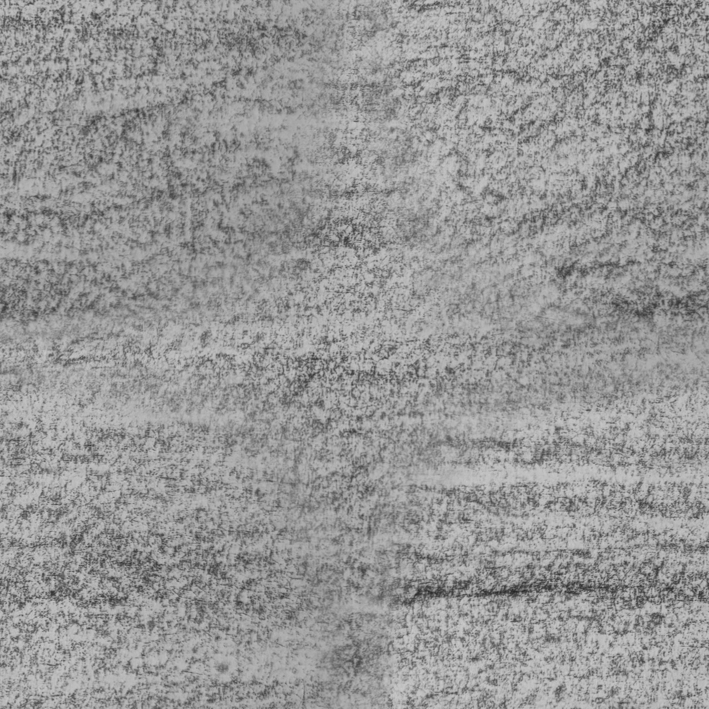
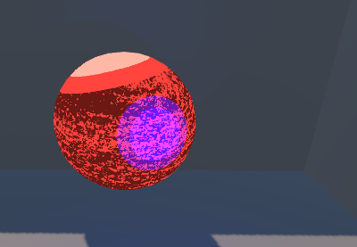

# HW 4: *3D Stylization*

## Features Overview

### Part 1: Reference Image

For my reference, I took inspiration from various pieces of kingdom hearts cover art.
These all have a similar water color painted style with pencil outlines. In particular the image I referenced most was:

I believe this art was created by Tetsuya Nomura, but I wasn't able to tell if that was truly the case. It is a booklet that was given out to people who pre-ordered KH 2 Final Mix +.

### Part 2: Shaders

For adding multiple light support, I made some modifications to the helper code in order to both discretize the additional light diffuse values, as well as the main light diffuse values. I ended up using the sum of both light values in my output shader for diffuse + specular, and utilized just the main light shadow for textured shadows since I thought it got a bit too messy otherwise. 

As mentioned, I added a specular highlight to the main light source, since it gave the scene a bit more color depth compared to just 3 tone shaders, while still getting a discretized shading look.

For my shadow, I ended up actually pulling out a sketchbook and a graphite block to just rub over the surface to get the texture of the sketchbook paper to reveal in a texture. This is what the final tiled texture looked like:

In my final scene, this texture is less aparent since I have a painterly effect plastered on top, but in a raw scene it looked something like this:

For my surface shader, I decided to both add a hue shifting effect as well as a kuwahara filter since my hue shift didn't have a lot of complexity or used many toolbox functions. For my hue shift I used a sine wave over time to shift hues up and down by a customizable parameter magnitude and speed. I made this effect have a very high magnitude on the popsicles to make them pop out of the scene which I think is a fun touch.

For the kuwahara filter, I implemented this as a post process effect. The general idea of a kuwahara filter is to divide a pixels suroundings into 4 quadrants, and assign that pixel with the average of the quadrant with the lowest variance. This creates streaks in the output that kind of look like paint strokes. Note that I did this effect before applying outlines to ensure outlines still stay sharp.

### Outlines

I opted to mix some of the outline techniques together, since I found the best effect with sobel kernels, but wanted to also use my normal buffer for them. I do have support for outlines based on color, but for my final product I chose to have stationary outlines based on normals, and wiggling outlines based on depth information. 

I made the depth outlines wiggle by applying a gradient noise to the central UV coordinate when sampling depth values which scrolls over time, but has a floor function applied to time so it isn't constantly moving.

### Post Process Effect

Apart from the kuwahara filter, I also implemented a white vignette since my reference image kind of fades into white around the edges. I also added a bit of noise to the vignette so it wasn't super harsh and made the image look more worn in.

### The Scene

In my main scene, I set up spongebob and squidward chilling out eating a popsicle similar to sora and roxas in the cover art I took as inspiration.

The squidward model is made by 3D by Renato on Sketchfab under the CC license. Model: https://sketchfab.com/3d-models/squidward-spongebob-7b35d58ae22d480a9d365ccda411b086. 
CC License: https://creativecommons.org/licenses/by/4.0/

The spongegbob model is by Gummibar gumy bear on Sketchfab under the CC license. Model: https://sketchfab.com/3d-models/hip-hop-dancing-spongebob-16f1c72703974d35957eeeabb4ff3d32.
CC License: https://creativecommons.org/licenses/by/4.0/

And finally the popsicle model is by ZREEL on Sketchfab under the CC License. Model: https://sketchfab.com/3d-models/popsicle-ice-cream-isometric-c34b893d6e7c4267abad4b4fc79ff01a
CC License: https://creativecommons.org/licenses/by/4.0/

As an addition, I also used a model of a granny for testing which is still in the project files from mixamo: https://www.mixamo.com/#/?page=1&query=Sporty+Granny&type=Character 

### Interactivity

For my interactive mode, I implemented a "CRT" mode that mimics a glitchy CRT monitor. This can be toggled by pressing "C" on your keyboard when playing. It causes there to be a blur with moving scanlines and chromatic aberration, as well as occasional glitches I implemented by picking random movement vectors and thresholding a white noise function that scrolled over time.

## Showcase

### Plain Scene

<video src="Videos/PlainScene.mp4" width="320" height="240" controls></video>

### CRT Mode

<video src="Videos/CRTScene.mp4" width="320" height="240" controls></video>

### Textured shadow without kuwahara filter applied

