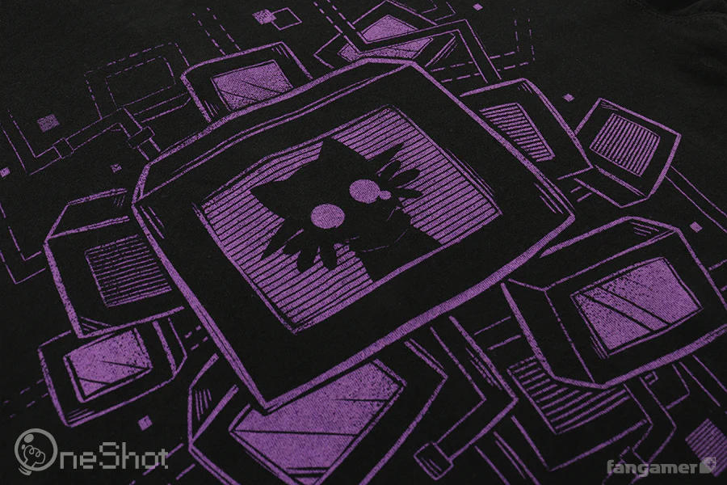
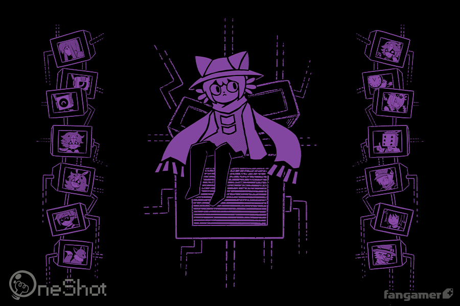
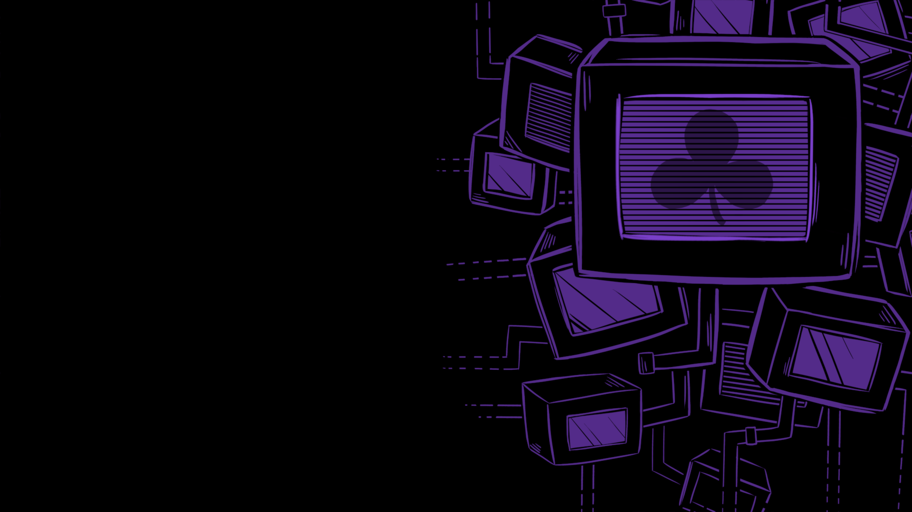
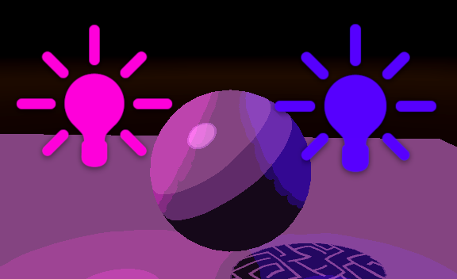
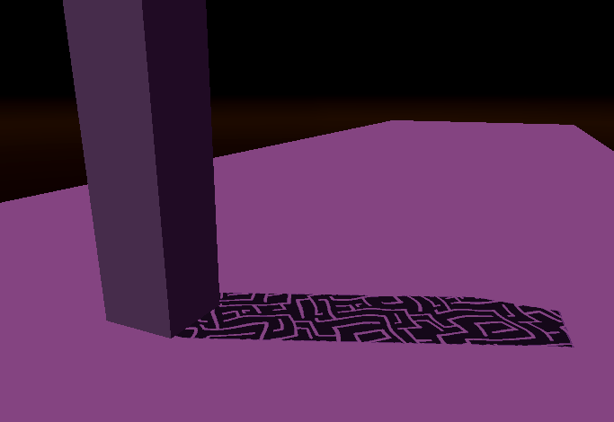
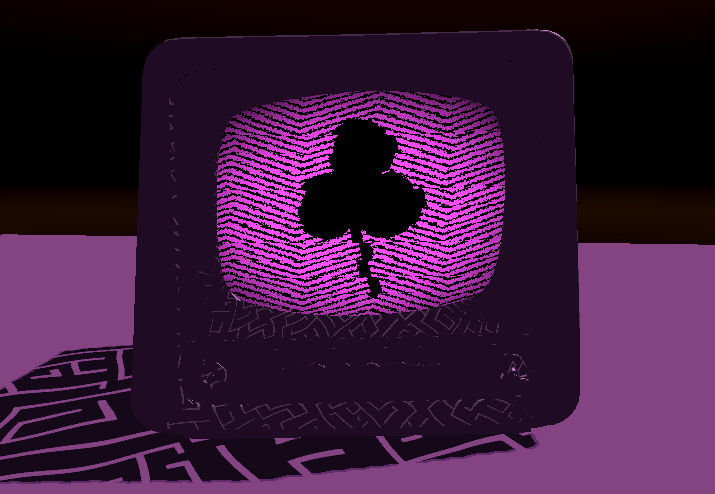
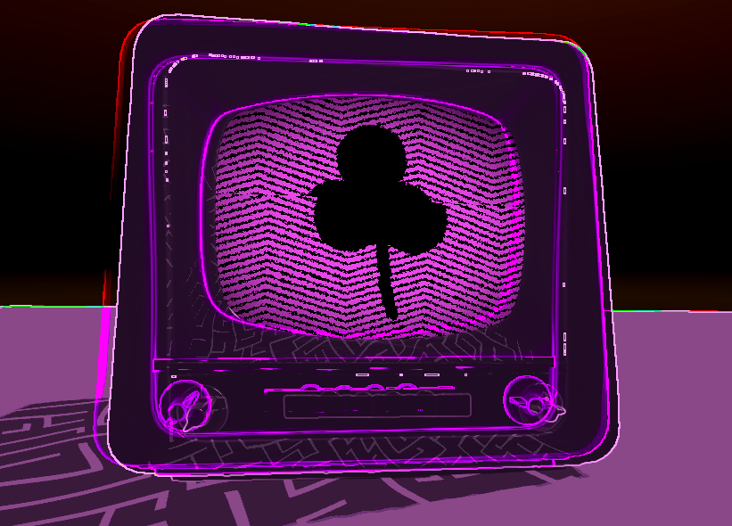
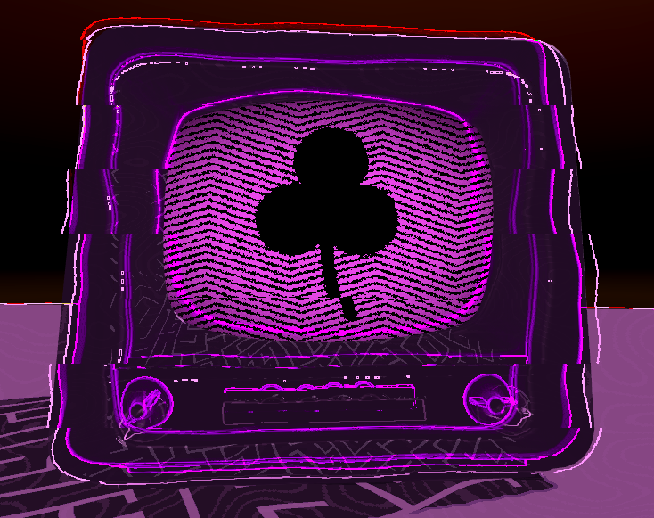
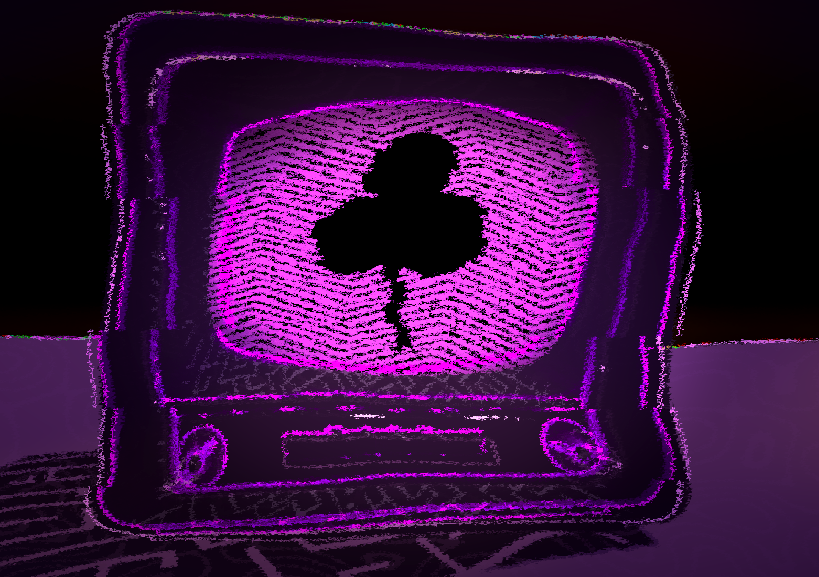
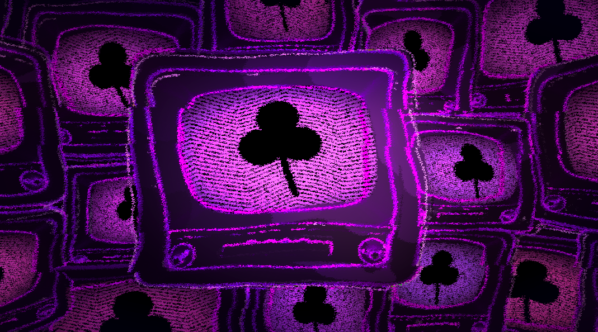

# HW 4: *3D Stylization*

## Overview

For this project, I created a stylized 3D scene in Unity based off of 2D art of the game OneShot.  Below is the final result.

INSERT FINAL RESULT

## Concept Art

|  |  |  |
|:--:|:--:|:--:|
| [Design](https://www.fangamer.com/products/oneshot-hoodie-world-machine) by NightMargin | [Design](https://www.fangamer.com/products/oneshot-hoodie-world-machine) by NightMargin | Wallpaper from [OneShot: World Machine Edition](https://store.steampowered.com/app/2915460/OneShot_World_Machine_Edition/) |

---
## Improved Surface Shader

After implementing toon shading, I added multiple light support as well as specular highlights.  I apply noise to the light received from every light source in order to achieve a more stylized effect.

I also created a custom texture that I used to modify the hard shadows.  I also added turbulence to these shadows using noise based on UV.

## Special Surface Shader

I made my special surface shader a TV screen as that's what I was planning on making my scene based on.  I downloaded [this](https://sketchfab.com/3d-models/black-and-white-belweder-ot-1782-tv-set-5c2be264f3ce4e11ac9387505e0bcea0) TV model, published by the Virtual Museums of Malopolska, off of Sketchfab.  I wrote a procedural sawtoothe wave texture in HLSL and distorted it with noise.  I added a vignette to the screen and a clover in the center using SDFs.

I also distorted the vertex positions using noise with respect to posterized time.  Posterizing time gives the appearance of animation at a very low framerate.  I also added a glitch effect to the TV screen by offsetting the UV horizontally with respect to noise on the UV's y position.

https://github.com/user-attachments/assets/05f9ac78-ba59-4b0f-9f15-d5365cb7c67f

## Outlines
I created a Post Processing shader that creates outlines using a sobel filter on the depth texture: at parts of the screen where there's a strong horizontal or vertical change in depth, an outline will display.

I then added another outline based on the change in normal across the object.  At parts of the screen where there's a drastic change in normal, an outline will display.  I made the radius in which we sample parts of the screen to check changes in normal pretty large to create blurry outlines.

I then displaced the UVs used to create the outline effects so that the normals don't conform to the object.  To offset the UVs, I used 2D FBM and a horizontal glitch offset very similar to the screen's glitch effect.

## Full Screen Post Process Effect
I created another Post Processing shader that displaces the UVs using multiple layers of FBM, creating a noisy effect.  I also added a vignette, blue tint, and an increase in brightness near the center of the screen.

---
## Custom Scene
I created a basic scene using the TV 3D model.  I made a wall of TVs surrounding the camera.  I made the colors of the TVs randomly vary slightly in hue by instancing the screen material on a per TV basis.

## Interactivity

When the user clicks on a TV, it changes its channel (swaps to a different color).  I animate the glitch parameter on the TV when the channel is changed.

https://github.com/user-attachments/assets/f37b182e-76f1-4994-a09b-eb820054edba

I also added the grayscale mode: when the user presses the spacebar, all of the TVs turn off and the scene becomes grayscale.  All of the TVs lose their clover except a random TV; the user transfer the white clover to a TV by clicking on it.

INSERT MONOCHROMEMODE HERE

