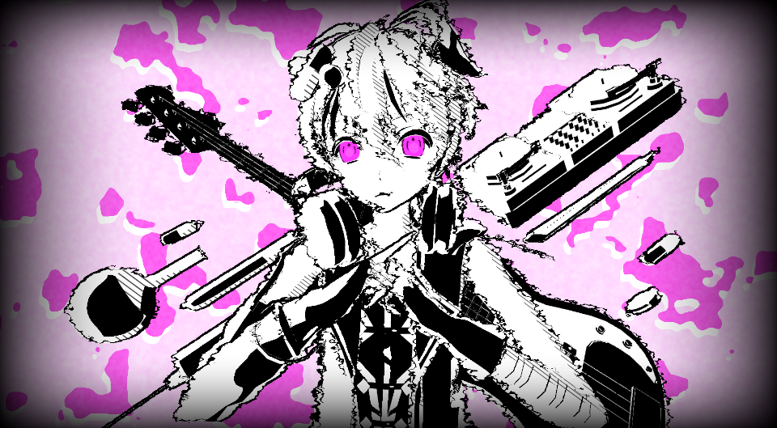
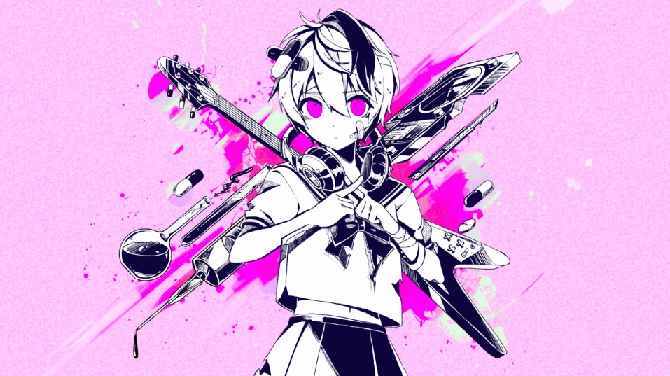
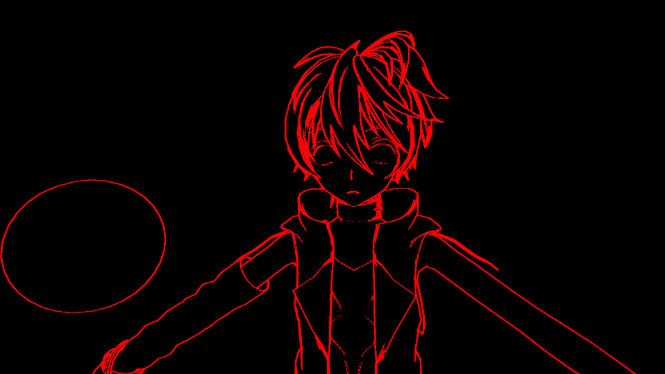
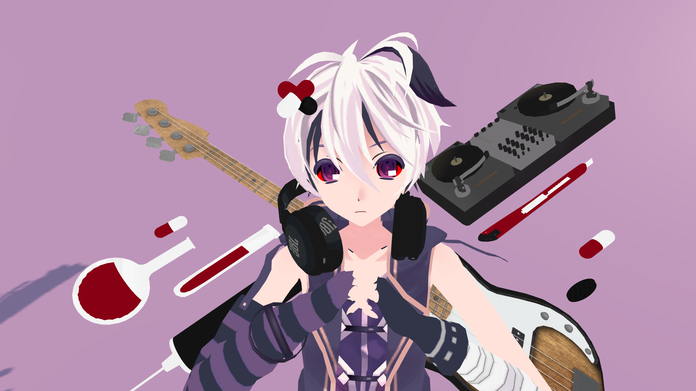
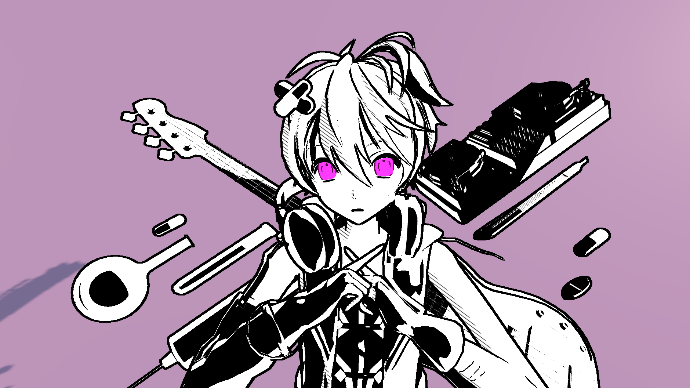
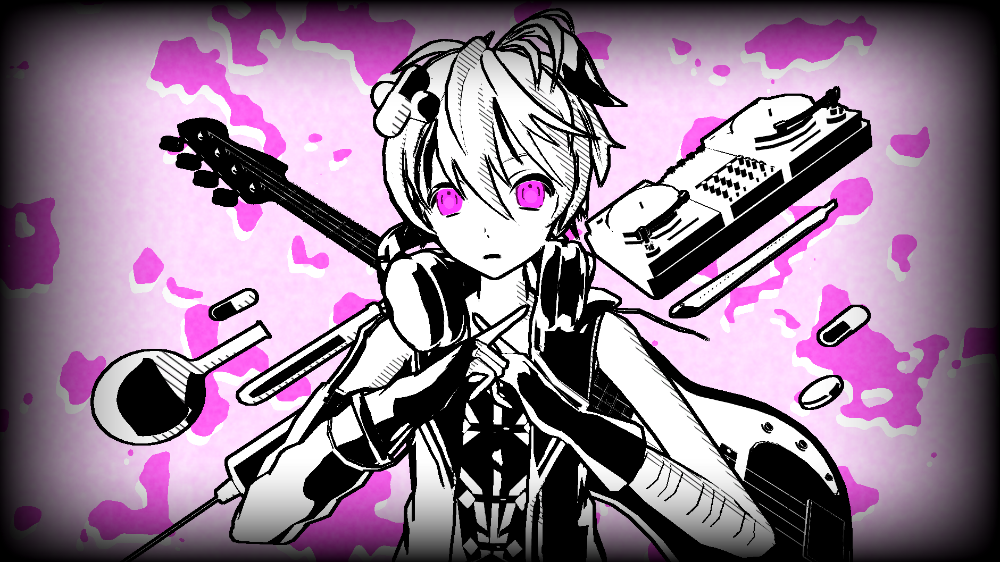

# Submission

Stylization effect created based on the cover image of the song ベノム, illustrated by のう (@nounoknown)

Simple Demo Video:
https://youtu.be/HyA39n0s2o8

# Outline

Outline effect (using Normal & Depth buffers):

# Simple Scene

Images with and without effect.

Models used in the scene are listed in Credits.txt.

# Shaders

Main Shader:

Seperates the textures based on their color into two different materials that act differently.

The darker part of the material will be mostly fully black but has a added rim light effect, the rim light is amplified in the normal direction.

The lighter part of the material is further separated into fully white, textured shadow, and fully dark regions using toon shader logic.

The background of the scene also uses some simple noise - the position of this noise can be changed by holding a key in play mode.

Multilight support:
 I couldn't find a good use for it in the scene, but it is implemented - I used two very small lights to give the eyes a very faint highlight in the final scene.

# Interactivity

- Directional Light will spin during play mode

- User can control camera movement using Mouse Right and WASD

- a very simple change in the background effect when the B button is held.

# Post Processing

very simple vignett effect that darkenss the border of the screen.

# Extra Line effect

It is a time based effect!
Can be configured using the LineVibrationStrength Variable. in the Full Screen Shader.

# Notes

Models used in the scene are listed in Credits.txt.

There are still some features that are incomplete - unfortunatelly couldn't finish in time.
I'm also using a late day for this assignment (if the course policy allows it ofc)
