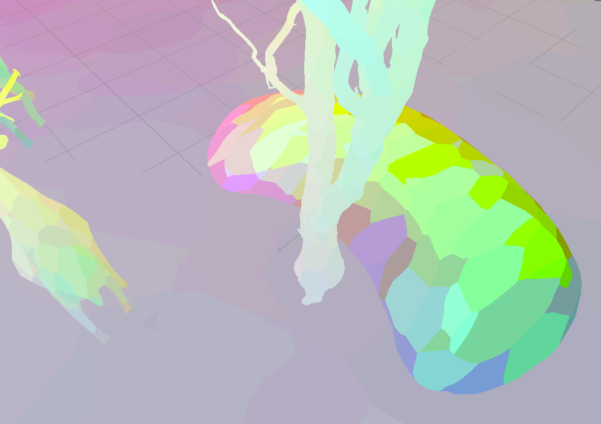

## My stylized scene

I was aiming for a mix of painterly + pencil-sketchy feel, like in a Van Gogh painting:

## Breakdown

To create a flat, painterly effect, I sampled a voronoi texture to define my normals.

Voronoi-sampled normals:

Added distortion using a hand-drawn noise texture:

Color output:

Shadows using a sketchy hatch texture I drew:

For my special shader, I shifted the color space from rgb to hsv, slightly shifted the hue component
randomly to more closely match Gogh's use of unmixed, spotty colors. I primarily used this shader for
my final scene.
I also implemented multiple light support and tried to match the warm, orange color palette of Van Gogh's.

In my post-processing shader, I implemented sobel filter outlines using the depth buffer
and robert's cross filters using the normal buffer. (In the final render, I figured it looks better
with just normal outlines.)
As a final touch I added vignette.

You can toggle between a morning scene and a night scene using the spacebar!
|  

## Models
https://www.fab.com/listings/5c0c8fc3-6284-4604-8913-884edf1053d4
https://www.fab.com/listings/32d7481a-1d30-4d41-a269-b05bde869a9d
https://www.fab.com/listings/c0c4ec3a-8773-4175-9136-4e505acc5140

