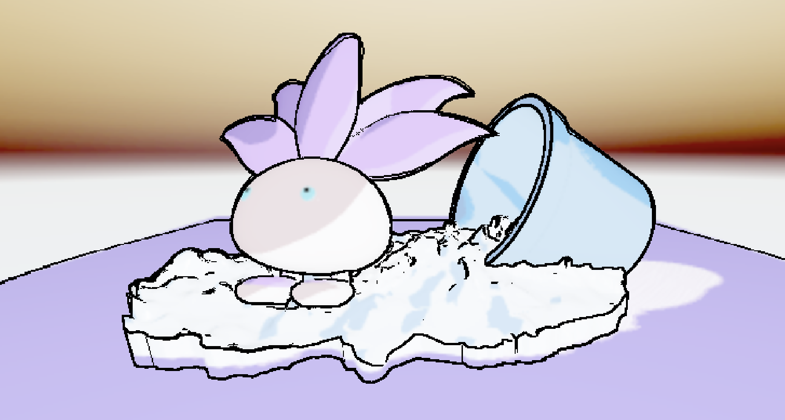

# HW 4: *3D Stylization*

||
|:--:|
|*Stylized Oddish: [Full Turn Around Video](Img/OddishRecording.mov)*|

### Overview
The goal for this project was to use a 2D concept art piece as inspiration to create a 3D stylized scene in Unity.

### Concept Art
For my concept art I decided to choose this drawing of Oddish from Pokemon:

*circa 1999, Erika’s Oddish  エリカのナゾノクサ by Ken Sugimori from the Pokémon TCG expansion Gym Challenge. Pokémon and Game Freak rare and original art, Downloaded from http://hirespokemon.tumblr.com. Colored art Scanned and enhanced by http://louminosus.tumblr.com and http://www.twitter.com/helixchamber. Outline enhanced from the original posted by Ken Sugimori on his twitter https://twitter.com/super_32x*

### Improved Surface Shader

First, I improved a basic 3 tone toon shader so that it had both multi light support, and a rim lighting effect.

||||
|:--:|:--:|:--:|
|*Unmodified 3 tone toon shader*|*Multi Light Support*|*Rim Light*|

### Interesting Shadows, Outlines, and Creating a Scene

Next I added a more interesting shadow texture to the ground which a drew in procreate, and used Robert's Cross filters for edge detection based on both depth and normals in order to create a post process outline shader. Then I did my best to replicate the concept art by using some models I found online and by adjusting the base colors of my surface shaders to better fit the scene: [Oddish Model](https://sketchfab.com/3d-models/oddish-8d2eef1f8a694a5db5505157794fec83), [Pot Model](https://sketchfab.com/3d-models/pot-092160ab6c324d2289bbb67e6e5d5503), and [Soil Model](https://www.cgtrader.com/free-3d-models/scanned/various/piles-of-rock). Additionally I added a special verion of my surface shader which animates the colors of the main body of oddish which can be seen in the gif or linked video at the top of the repo. 

### Full Screen Post Process Effect and Interactivity
Lastly, I added a bunch of different post process effects that could interactively be toggled on using the space key and switched between using 'n'. This gave the scene several unique looks (my favorite being the more saturated one) and also showcased the fact that our scene is being rendered in real-time!

|||
|:--:|:--:|
|*Greyscale Oddish*|*Inverted Oddish*|
|||
|*Sepia Oddish*|*Saturated Oddish*|

### Resources

[Oddish Model](https://sketchfab.com/3d-models/oddish-8d2eef1f8a694a5db5505157794fec83)

[Pot Model](https://sketchfab.com/3d-models/pot-092160ab6c324d2289bbb67e6e5d5503)

[Soil Model](https://www.cgtrader.com/free-3d-models/scanned/various/piles-of-rock)